<h1 align="center">Hi, I’m Ezzat.</h1>

<strong>AI Builder &amp; Digital Creator</strong> · Egypt · Arch Linux · Guitar

<h3 align="center"><code>unknown@github ~ $ ./contributions.sh</code></h3>

  

<h3 align="center"><code>unknown@github ~ $ whoami</code></h3>
<table align="center">
  <tr>
    <td valign="top"></td>
    <td valign="top"></td>
  </tr>
</table>

I’m a Tourism Guidance student from Egypt who enjoys turning ideas into web projects with AI. I’m learning JavaScript and front-end fundamentals as I go, tinkering with Linux, and making time for guitar.

### `~/toolbox`

  <strong>Learning &amp; Building With</strong> 
  &nbsp;
  &nbsp;
  &nbsp;
  &nbsp;
  

  <strong>AI Tools</strong> 
  &nbsp;
  &nbsp;
  &nbsp;
  

  <strong>Dev &amp; OS</strong> 
  &nbsp;
  &nbsp;
  &nbsp;
  &nbsp;
  

### `~/outside-the-terminal`

I enjoy experimenting with Linux distros, breaking things, and figuring out how to fix them. Away from the screen, you’ll probably find me playing guitar.

### `~/connect`

  &nbsp;
  

Discord: `unknown.3663` · [Email](mailto:ezzatmagedsamir@gmail.com) · [Instagram](https://www.instagram.com/zez0dev/)
